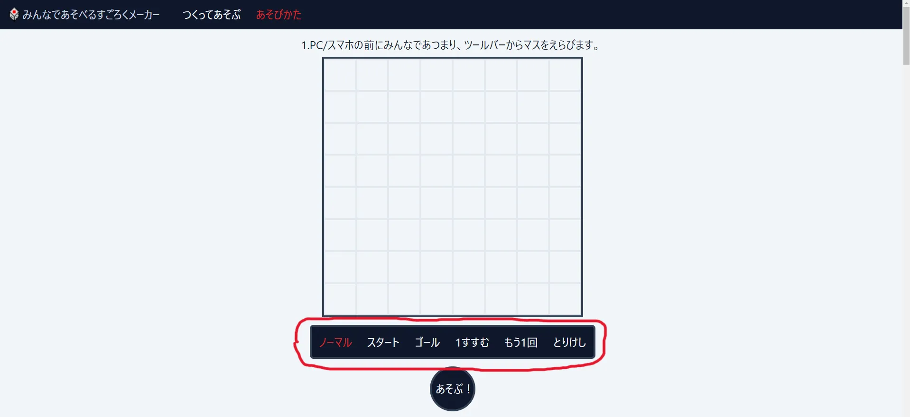
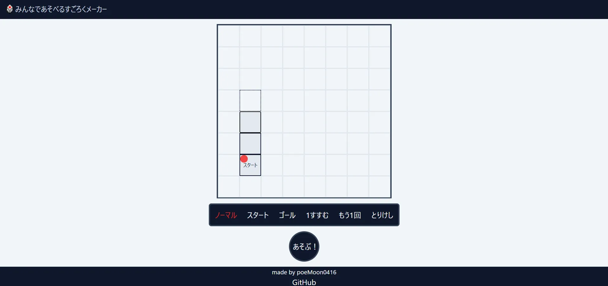
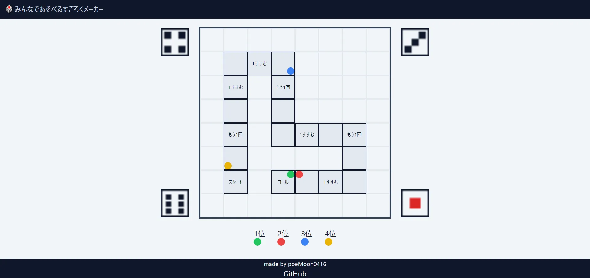

# みんなであそべるすごろくメーカー🎲

- [公開ページ](https://everyone-sugoroku-maker.deno.dev)
- [Qiita記事](https://qiita.com/poeMoon/items/973871f647ad5c351d5d)
- [X(旧Twitter)](https://x.com/_poeMoon_)

### 9/23 オンライン機能追加🌐

「つくってあそぶ」ページで同じURL(ルーム)にアクセスすればオンラインプレイできるようにしました。 

### 9/16 スワイプ機能追加👆

「つくってあそぶ」ページでPC/モバイルからボードをなぞってマスを配置できるようにして操作感を改善しました。 

### 9/1 「あそびかた」ページ追加📄

すごろくをつくってあそぶための一連の操作に対する説明を追加して分かりやすくしました。 

### 8/26 リリース✨

すごろくをつくってあそぶために必要なコア機能を開発して公開しました。 

